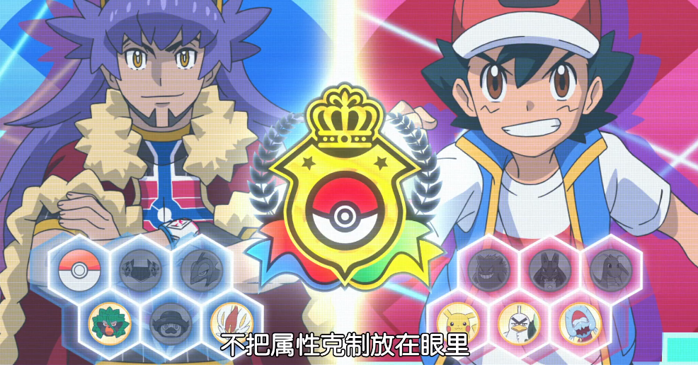

# 享元模式

## 1 介绍

享元模式很好理解，它主要是为了减少创建对象的数量，属于结构型设计模式

- 目的：减少创建对象的次数
- 方法：复用对象
- 何时使用：系统大量需要对象，该创建对象的消耗很大

享元模式有3个角色：

- 抽象享元类(Flyweight)：声明享元类的公共方法
- 具体享元对象(Concrete Flyweight)：抽象享元类的具体实现
- 享元工厂类(Flyweight Factory)：创建、管理享元对象。

还是老样子，一上来一堆概念和角色名次，如果不熟悉线程池的读者朋友，或许还是云里雾里。

那么，进入宝可梦世界。

## 2 情景模拟




玩过宝可梦的读者都知道，一场战斗开始之前，双方都要携带一定数量的宝可梦，当一方所有宝可梦都战斗不能时，就被判负。

每个回合也可以选择继续出招或者收回宝可梦，如果选择收回，那下次放出来的时候，还是会延续收回之前的状态，因为收回后再拿出来很明显是对同一个宝可梦进行的，皮卡丘收回去之后，这个精灵球里下次出来的还是皮卡丘，而且是收回来的皮卡丘，不是一个满血满状态的。

那么享元模式工厂维护的“享元池”，就有对象第一次创建的时机，可以是第一次使用的时候。

那么一场战斗携带的精灵就是复用的，这也可以引出享元模式的角色：

- 抽象享元类：宝可梦，定义了公共方法，如登场，掉血
- 具体享元类：具体的宝可梦
- 享元工厂类：一场战斗的精灵包，维护全体精灵这个享元池

## 3 代码

抽象类

```java
/**
 * 宝可梦抽象类
 * 对应抽象享元类
 * Flyweight
 */
public interface Pokemon {
    /**
     * 宝可梦出场
     */
    void go();

    /**
     * 宝可梦在战斗中损失HP
     * @param damage HP
     */
    void loseHP(Integer damage);
}
```

具体类

```java
/**
 * 宝可梦具体实现类
 * 对应具体享元类
 * ConcreteFlyweight
 */
public class ConcretePokemon implements Pokemon{
    String name;
    Integer hp = 100;

    public ConcretePokemon(String name) {
        this.name = name;
    }

    @Override
    public void go() {
        System.out.println("去吧!" + this.name + "! (HP:" + this.hp + ")");
    }

    @Override
    public void loseHP(Integer damage) {
        this.hp -= damage;
    }
}
```


享元工厂

```java
/**
 * 模拟一场战斗的精灵背包
 * 对应享元工厂类
 * FlyweightFactory
 */
public class FlyweightFactory {
    // 用一个哈希表判断对象是否存在
    private HashMap<String, Pokemon> pokemonPool = new HashMap<>();

    /**
     * 获取宝可梦，如果没有出场过，就创建对象
     * 出场过的就返回之前创建的对象
     * @param name
     * @return
     */
    public Pokemon getPokemon(String name){
        // 用名字获取对象 存在就取出 不存在就创建后存入哈希表
        if(!pokemonPool.containsKey(name)){
            pokemonPool.put(name, new ConcretePokemon(name));
        }
        Pokemon pokemon = pokemonPool.get(name);
        pokemon.go();
        return pokemon;
    }
}
```


**测试类**

模拟一场宝可梦战斗，两位训练家小智satoshi和小茂shigeru分别维护各自的享元池，第一次派出精灵时，创建对象。第一回合战斗中，皮卡丘掉血50。第二回合，小智任然派出皮卡丘，可以看到，皮卡丘还是只有50血，因为是同一个对象

```java
public class FlyWeightDemo {
    public static void main(String[] args) {
        // 用工厂模拟2位对战训练家
        FlyweightFactory satoshi = new FlyweightFactory();
        FlyweightFactory shigeru = new FlyweightFactory();

        // 出场
        Pokemon pikachu = satoshi.getPokemon("皮卡丘");
        Pokemon charizard = shigeru.getPokemon("喷火龙");

        // 战斗
        // 皮卡丘掉了半血
        pikachu.loseHP(50);
        // 喷火龙gg...
        System.out.println("喷火龙倒下了...\n");

        // 第二轮
        satoshi.getPokemon("皮卡丘");
        shigeru.getPokemon("电击魔兽");
    }
}
```

```
去吧!皮卡丘! (HP:100)
去吧!喷火龙! (HP:100)
喷火龙倒下了...

去吧!皮卡丘! (HP:50)
去吧!电击魔兽! (HP:100)
```

## 4 应用

- 字符串常量池：创建后的字符串会保存在常量池中以供复用

```java
String a = "h";
String b = "h";
System.out.println(a == b);  // true
```

- Integer缓存：Integer提供了[-127,128]范围的缓存

```java
Integer a = 123;
Integer b = 123;
System.out.println(a == b);
```

- 数据库连接池
- 线程池
